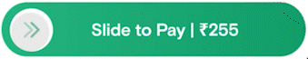

# React Native Sliding Button

A customizable slide-to-execute button for React Native applications.




## Features

- **Customizable Text**: Set a custom label for the button.
- **Threshold Control**: Define the percentage of the slider width required to trigger the action.
- **Animations**: Enjoy elastic bounce effects and visual feedback when sliding.
- **Gesture Support**: Utilizes gesture handling for smooth user interactions.

## System Design

For insights into the design process and considerations behind this sliding button component, check out this article:

[Understanding System Design for User Interfaces](https://medium.com/swiggydesign/healthy-friction-in-ux-a46c800cb479)

## Installation

You can install the package using npm:

```bash
npm install slide-button-with-threshold
```

Make sure to also install the required peer dependencies if they are not already included in your project:

```bash
npm install react-native-gesture-handler react react-native
```

Additionally, wrap your main application component with `GestureHandlerRootView` to enable gesture handling:

```javascript
import React from "react";
import { GestureHandlerRootView } from "react-native-gesture-handler";

const App = () => {
  return (
    <GestureHandlerRootView style={{ flex: 1 }}>
      {/* Your app components */}
    </GestureHandlerRootView>
  );
};
```

## How to Use the Package

Import the necessary components from React Native and your package. Here's an example of how to implement the sliding button:

```javascript
import React from "react";
import { Alert, SafeAreaView } from "react-native";
import SlideToPayButton from "slide-button-with-threshold";
import { GestureHandlerRootView } from "react-native-gesture-handler";

const App = () => {
  const handleActionComplete = () => {
    Alert.alert("Action completed!");
  };

  return (
    <SafeAreaView
      style={{
        flex: 1,
        justifyContent: "center",
        alignItems: "center",
      }}
    >
      <GestureHandlerRootView>
        <SlideToPayButton
          onComplete={handleActionComplete}
          // text="Slide to Execute" // Custom label
          // threshold={0.7} // Custom threshold
          // sliderWidth={300} // Custom slider width
          // sliderHeight={70} // Custom slider height
          // thumbWidth={55} // Custom thumb width
        />
      </GestureHandlerRootView>
    </SafeAreaView>
  );
};

export default App;
```

### Props

- **`text`** _(string)_: Custom label for the button (default: "Slide to Execute").
- **`threshold`** _(number)_: Percentage of slider width to reach for action completion (default: `0.7`).
- **`sliderWidth`** _(number)_: Width of the slider (default: `300`).
- **`sliderHeight`** _(number)_: Height of the slider (default: `70`).
- **`thumbWidth`** _(number)_: Width of the draggable thumb (default: 55).
- **`onComplete`** _(function)_: Callback function to be called when the action is completed.

Feel free to customize the props to fit your design requirements!
